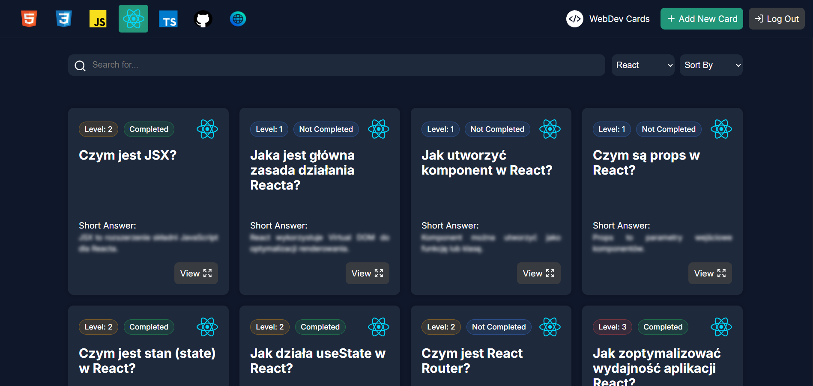

# WebGDev Checky Cards

A personal learning tool and flashcard app for web development — browse, filter, and track progress through knowledge cards covering React, JavaScript, TypeScript, HTML, CSS, Git, and Web fundamentals.

**Live demo:** [webgdev-checky-cards.vercel.app](https://webgdev-checky-cards.vercel.app)
## 

> New cards are added on a regular basis as topics are studied and explored.

---

## Project Purpose

This project was created as part of my path of learning and practicing React development.

The main objectives are:

- Practice React in a real project environment
- Build a scalable Single Page Application architecture
- Improve state management patterns
- Implement authentication, protected routes, and contexts
- Work with forms, pagination, and filtering
- Apply clean component design and separation of concerns

**This is also a personal learning tool I actively use every day.** By regularly creating and revisiting cards, the goal is to reinforce important concepts and build a structured knowledge base on my path to becoming a Frontend React Developer.

---

## Main Idea

WebGDev Checky Cards is a knowledge management tool designed for developers who want to organize and review important concepts across different web technologies.

Each card contains:

- **Question** — the topic or concept being learned
- **Category** — HTML, CSS, JavaScript, React, TypeScript, Git, or Web Basics
- **Short Answer** — a concise summary, revealable on hover or click
- **Extended Description** — full explanation with Markdown formatting and syntax-highlighted code examples
- **Resources** — links to documentation or articles
- **Difficulty Level** — 1 (Beginner) to 4 (Expert)
- **Priority Level** — 1 (Low) to 4 (High), used for sorting and focus
- **Completion Status** — track which topics you've covered

---

## Features

### Card Management
- Create, edit, and delete cards (authenticated users only)
- Toggle completion status per card
- Markdown descriptions with syntax-highlighted code blocks
- Inline markdown formatting guide available in the editor

### Browsing & Discovery
- Filter by technology category
- Full-text search across questions, answers, and descriptions
- Sort by level, priority, or completion status
- Responsive pagination — adapts items per page to screen size

### Theme
- Light, Dark, and Auto (system preference detection) modes
- Manual toggle available regardless of system setting

### Answer Reveal
- Choose between **hover** or **click** to reveal the short answer on card list

### Fully Responsive
- Works on mobile, tablet, and desktop
- Accessible on iPhone Safari with no setup required

---

## Tech Stack

| Layer | Technology |
|---|---|
| Frontend | React 19, React Router 7, Vite |
| Backend | Supabase (PostgreSQL + REST API) |
| Hosting | Vercel |
| Styling | CSS Modules |
| Content | React Markdown, React Syntax Highlighter |

---

## Categories

`React` `JavaScript` `TypeScript` `HTML` `CSS` `Git` `Web Basics`

---

## Difficulty & Priority Levels

| Level | Difficulty | Priority |
|---|---|---|
| 1 | Beginner | Low |
| 2 | Intermediate | Normal |
| 3 | Advanced | High |
| 4 | Expert | Critical |

---

## React Concepts Practiced

- Functional Components & Props
- `useState`, `useEffect`, `useActionState`, `useId`
- Controlled Forms
- Custom Hooks
- Context API (Theme, Auth, RevealAnswer)
- React Router with Protected Routes
- Pagination Logic
- Component Composition & Separation of Concerns
- Performance patterns (`memo`, `useCallback`, `useMemo`)

---

## Architecture

- Single Page Application (SPA)
- Modular component structure
- Reusable UI components (Button, Badge, Card, Form, etc.)
- Clear separation of concerns
- Supabase as persistent backend — fully deployed, no local server needed

---

## Local Development

```bash
# Clone the repository
git clone https://github.com/ep1cvoice/webgdev-checky-cards.git

# Install dependencies
npm install

# Start the dev server
npm run dev
```

> The app connects to the hosted Supabase database by default. To use your own database, add a `.env` file with `VITE_SUPABASE_URL` and `VITE_SUPABASE_PUBLISHABLE_KEY`.
